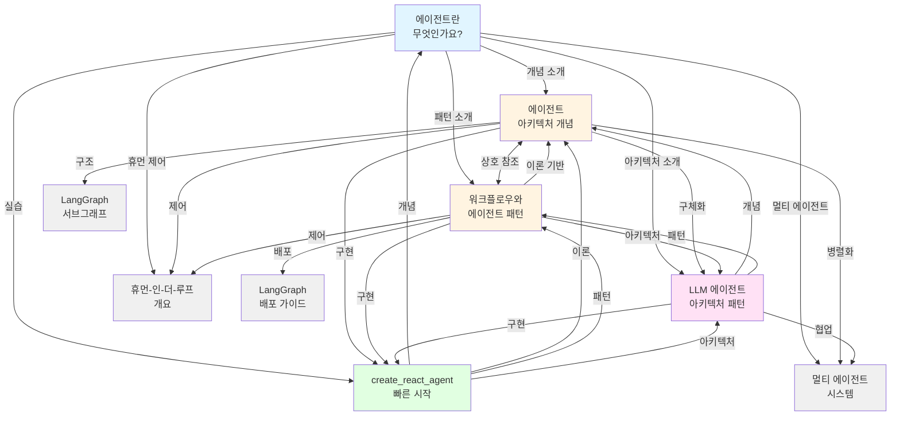

# 문서 네트워크 시각화

## 에이전트 문서 네트워크 구조도



## 문서 계층 구조

```
📚 LangGraph 에이전트 지식 베이스
│
├─ 📖 입문 (Entry Point)
│  └─ 에이전트란 무엇인가요?
│     ├─ 에이전트 정의
│     ├─ 주요 특징
│     └─ 패키지 생태계
│
├─ 🧠 핵심 개념 (Core Concepts)
│  ├─ 에이전트 아키텍처 개념
│  │  ├─ Router 아키텍처
│  │  ├─ Tool-Calling Agent
│  │  └─ Custom Architecture
│  │
│  └─ 워크플로우와 에이전트 패턴
│     ├─ 워크플로우 패턴
│     │  ├─ Prompt Chaining
│     │  ├─ Parallelization
│     │  ├─ Routing
│     │  ├─ Orchestrator-Worker
│     │  └─ Evaluator-Optimizer
│     │
│     └─ 에이전트 패턴
│        └─ Tool-Calling Agent
│
├─ 🏗️ 아키텍처 (Architecture)
│  └─ LLM 에이전트 아키텍처 패턴
│     ├─ ReAct
│     ├─ Plan-and-Execute
│     └─ Supervisor
│
├─ 💻 실습 (Hands-on)
│  └─ 사전 구축된 에이전트로 빠르게 시작하기
│     ├─ 환경 설정
│     ├─ 에이전트 생성
│     ├─ 프롬프트 추가
│     ├─ 메모리 추가
│     └─ 구조화된 출력
│
└─ 🔗 관련 개념 (Related Concepts)
   ├─ 멀티 에이전트 시스템
   ├─ 휴먼-인-더-루프
   ├─ LangGraph 서브그래프
   └─ LangGraph 배포
```

## 주제별 연결 맵

### 1. 도구 호출 (Tool Calling)

```
에이전트 아키텍처 개념
    ├─ 도구 호출 기본 개념
    │
    ↓
워크플로우와 에이전트 패턴
    ├─ Tool-Calling Agent 패턴
    ├─ 증강된 LLM (도구 바인딩)
    │
    ↓
create_react_agent
    └─ 실제 도구 구현 및 사용
```

### 2. 메모리 (Memory)

```
에이전트 아키텍처 개념
    ├─ State (상태 스키마)
    ├─ Checkpointer (세션 저장)
    ├─ Store (세션 간 저장)
    │
    ↓
워크플로우와 에이전트 패턴
    ├─ 지속성: 메모리
    ├─ 대화형/장기 메모리
    │
    ↓
create_react_agent
    └─ InMemorySaver 구현
```

### 3. 제어 흐름 (Control Flow)

```
에이전트 아키텍처 개념
    ├─ Router (단일 결정)
    ├─ Tool-Calling Agent (다단계)
    ├─ Custom Architecture
    │
    ↓
워크플로우와 에이전트 패턴
    ├─ Routing 패턴
    ├─ Orchestrator-Worker
    ├─ Evaluator-Optimizer
    │
    ↓
LLM 에이전트 아키텍처 패턴
    ├─ ReAct (반복적 제어)
    ├─ Plan-and-Execute (계획적 제어)
    └─ Supervisor (중앙 집중 제어)
```

### 4. 병렬화 (Parallelization)

```
에이전트 아키텍처 개념
    ├─ 병렬화 개념
    ├─ Send API
    │
    ↓
워크플로우와 에이전트 패턴
    ├─ Parallelization 패턴
    ├─ Orchestrator-Worker
    │
    ↓
멀티 에이전트 시스템
    ├─ 네트워크 아키텍처
    ├─ 슈퍼바이저 아키텍처
    └─ 계층적 아키텍처
```

### 5. 휴먼-인-더-루프 (Human-in-the-Loop)

```
에이전트 아키텍처 개념
    ├─ 휴먼-인-더-루프 기본 개념
    ├─ Interrupt 사용
    │
    ↓
워크플로우와 에이전트 패턴
    ├─ 지속성: 휴먼-인-더-루프
    ├─ 중단 및 승인
    │
    ↓
휴먼-인-더-루프 개요
    ├─ 실행 상태 영속성
    ├─ 동적/정적 인터럽트
    └─ 4가지 설계 패턴
```

## 학습 경로 제안

### 초급 경로 (Beginner Path)

1. **에이전트란 무엇인가요?** (20분)
   - 에이전트 기본 개념
   - LangGraph 소개
   - 주요 기능 이해

2. **사전 구축된 에이전트로 빠르게 시작하기** (30분)
   - 환경 설정
   - 첫 번째 에이전트 만들기
   - 기본 기능 실습

3. **워크플로우와 에이전트 패턴** (40분)
   - 기본 워크플로우 패턴 학습
   - 간단한 에이전트 패턴 이해

### 중급 경로 (Intermediate Path)

1. **에이전트 아키텍처 개념** (45분)
   - Router 아키텍처
   - Tool-Calling Agent 심화
   - 구조화된 출력, 도구 호출

2. **LLM 에이전트 아키텍처 패턴** (30분)
   - ReAct 패턴
   - Plan-and-Execute 패턴
   - Supervisor 패턴

3. **휴먼-인-더-루프** (30분)
   - 중단 및 승인 패턴
   - 상태 검토 및 편집

### 고급 경로 (Advanced Path)

1. **워크플로우와 에이전트 패턴** 심화 (60분)
   - Orchestrator-Worker 패턴
   - Evaluator-Optimizer 패턴
   - 복잡한 워크플로우 설계

2. **멀티 에이전트 시스템** (60분)
   - 네트워크 아키텍처
   - 계층적 구조
   - 핸드오프 패턴

3. **커스텀 에이전트 아키텍처** (90분)
   - 서브그래프 활용
   - 반성 메커니즘
   - 병렬화 최적화

## 문서 간 관계 강도

```
강한 연결 (Strong Connection): ═══
중간 연결 (Medium Connection): ───
약한 연결 (Weak Connection):   ···

에이전트란 무엇인가요?
    ═══ 에이전트 아키텍처 개념
    ═══ 워크플로우와 에이전트 패턴
    ─── LLM 에이전트 아키텍처 패턴
    ─── create_react_agent

에이전트 아키텍처 개념
    ═══ 워크플로우와 에이전트 패턴 (상호 참조)
    ─── LLM 에이전트 아키텍처 패턴
    ─── create_react_agent
    ─── 멀티 에이전트 시스템
    ─── 휴먼-인-더-루프

워크플로우와 에이전트 패턴
    ═══ 에이전트 아키텍처 개념 (상호 참조)
    ─── LLM 에이전트 아키텍처 패턴
    ─── create_react_agent
    ─── 휴먼-인-더-루프
    ─── LangGraph 배포 가이드

LLM 에이전트 아키텍처 패턴
    ─── 에이전트 아키텍처 개념
    ─── 워크플로우와 에이전트 패턴
    ─── create_react_agent
    ─── 멀티 에이전트 시스템

create_react_agent
    ─── 에이전트란 무엇인가요?
    ─── 에이전트 아키텍처 개념
    ─── 워크플로우와 에이전트 패턴
    ─── LLM 에이전트 아키텍처 패턴
```

## 키워드 매핑

### 공통 키워드

| 키워드 | 등장 문서 | 연결 강도 |
|--------|----------|----------|
| **ReAct** | 5개 | ⭐⭐⭐⭐⭐ |
| **도구 호출** | 5개 | ⭐⭐⭐⭐⭐ |
| **메모리** | 4개 | ⭐⭐⭐⭐ |
| **LLM** | 5개 | ⭐⭐⭐⭐⭐ |
| **상태 관리** | 4개 | ⭐⭐⭐⭐ |
| **Router** | 3개 | ⭐⭐⭐ |
| **병렬화** | 3개 | ⭐⭐⭐ |
| **구조화된 출력** | 3개 | ⭐⭐⭐ |
| **계획** | 3개 | ⭐⭐⭐ |
| **Supervisor** | 3개 | ⭐⭐⭐ |

### 패턴별 키워드

**워크플로우 패턴:**
- Prompt Chaining
- Parallelization
- Routing
- Orchestrator-Worker
- Evaluator-Optimizer

**에이전트 아키텍처:**
- Router
- Tool-Calling Agent
- Custom Architecture
- ReAct
- Plan-and-Execute
- Supervisor

**제어 메커니즘:**
- Command
- Send API
- Interrupt
- Checkpointer
- State

## 결론

이 시각화는 LangGraph 에이전트 문서들이 어떻게 체계적으로 연결되어 있는지 보여줍니다:

✅ **명확한 학습 경로**: 입문 → 개념 → 아키텍처 → 실습
✅ **강한 상호 참조**: 핵심 문서들 간 양방향 링크
✅ **주제별 연결**: 도구 호출, 메모리, 제어 흐름 등
✅ **난이도별 구성**: 초급, 중급, 고급 경로 제공
