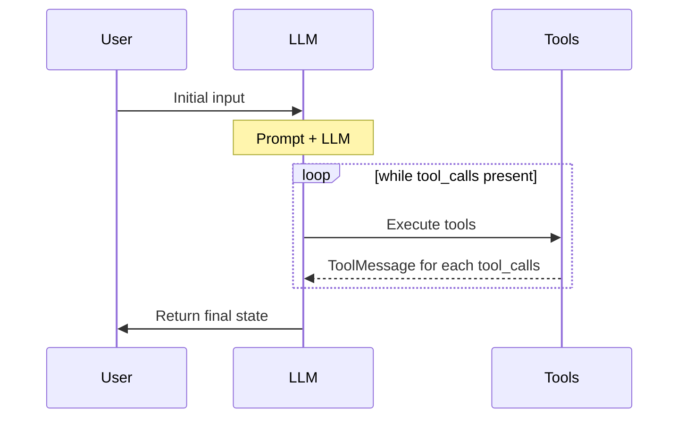

> [!warnint] `create_react_agent`는 deprecated 되었습니다.
> `create_react_agent` 대신 [`create_agent`](https://reference.langchain.com/python/langchain/agents/)를 사용합니다.
> 

## `class` AgentState

상속: `TypedDict`

에이전트의 상태입니다.

## `function` create_react_agent

중지 조건이 충족될 때까지 루프에서 도구를 호출하는 에이전트 그래프를 생성합니다.

```python
create_react_agent(
    model: Union[
        str,
        LanguageModelLike,
        Callable[
            [StateSchema, Runtime[ContextT]], BaseChatModel
        ],
        Callable[
            [StateSchema, Runtime[ContextT]],
            Awaitable[BaseChatModel],
        ],
        Callable[
            [StateSchema, Runtime[ContextT]],
            Runnable[LanguageModelInput, BaseMessage],
        ],
        Callable[
            [StateSchema, Runtime[ContextT]],
            Awaitable[
                Runnable[LanguageModelInput, BaseMessage]
            ],
        ],
    ],
    tools: Union[
        Sequence[Union[BaseTool, Callable, dict[str, Any]]],
        ToolNode,
    ],
    *,
    prompt: Optional[Prompt] = None,
    response_format: Optional[
        Union[
            StructuredResponseSchema,
            tuple[str, StructuredResponseSchema],
        ]
    ] = None,
    pre_model_hook: Optional[RunnableLike] = None,
    post_model_hook: Optional[RunnableLike] = None,
    state_schema: Optional[StateSchemaType] = None,
    context_schema: Optional[Type[Any]] = None,
    checkpointer: Optional[Checkpointer] = None,
    store: Optional[BaseStore] = None,
    interrupt_before: Optional[list[str]] = None,
    interrupt_after: Optional[list[str]] = None,
    debug: bool = False,
    version: Literal["v1", "v2"] = "v2",
    name: Optional[str] = None,
    **deprecated_kwargs: Any
) -> CompiledStateGraph
```

중지 조건이 충족될 때까지 루프에서 도구를 호출하는 에이전트 그래프를 생성합니다.

`create_react_agent` 사용에 대한 자세한 내용은 [에이전트](https://langchain-ai.github.io/langgraph/agents/overview/#visualize-an-agent-graph) 문서를 참조하세요.

### 매개변수

#### model

##### Type

`Union[str, LanguageModelLike, Callable[[StateSchema, Runtime[ContextT]], BaseChatModel], Callable[[StateSchema, Runtime[ContextT]], Awaitable[BaseChatModel]], Callable[[StateSchema, Runtime[ContextT]], Runnable[LanguageModelInput, BaseMessage]], Callable[[StateSchema, Runtime[ContextT]], Awaitable[Runnable[LanguageModelInput, BaseMessage]]]]`

##### Description

필수입니다.

에이전트가 사용할 언어 모델입니다. 정적 및 동적 모델 선택을 모두 지원합니다.

- **정적 모델**: 채팅 모델 인스턴스(예: `ChatOpenAI()`) 또는 문자열 식별자(예: `openai:gpt-4`)를 사용합니다.

- **동적 모델**: `(state, runtime) -> BaseChatModel` 시그니처를 가진 호출 가능 객체로, 런타임 컨텍스트에 따라 다른 모델을 반환합니다. 모델에 `.bind_tools()`나 다른 설정을 통해 도구가 바인딩되어 있는 경우, 반환 타입은 `Runnable[LanguageModelInput, BaseMessage]`여야 합니다. 코루틴도 지원되어 비동기 모델 선택이 가능합니다.

동적 함수는 그래프 상태와 런타임을 받아 컨텍스트에 따른 모델 선택을 가능하게 합니다. `BaseChatModel` 인스턴스를 반환해야 합니다. 도구 호출의 경우 `.bind_tools()`를 사용하여 도구를 바인딩해야 합니다. 바인딩된 도구는 반드시 `tools` 파라미터의 부분집합이어야 합니다.

**동적 모델 예시**:

```python
from dataclasses import dataclass

@dataclass
class ModelContext:
    model_name: str = "gpt-3.5-turbo"

# 전역으로 모델 인스턴스화
gpt4_model = ChatOpenAI(model="gpt-4")
gpt35_model = ChatOpenAI(model="gpt-3.5-turbo")

def select_model(state: AgentState, runtime: Runtime[ModelContext]) -> ChatOpenAI:
    model_name = runtime.context.model_name
    model = gpt4_model if model_name == "gpt-4" else gpt35_model
    return model.bind_tools(tools)
```

> [!info] **동적 모델 요구사항**
> 반환된 모델은 `.bind_tools()`를 통해 적절한 도구가 바인딩되어 있어야 하며, 필요한 기능을 지원해야 합니다. 바인딩된 도구는 tools 파라미터에 지정된 도구의 부분집합이어야 합니다.

#### tools

##### Type

`Union[Sequence[Union[BaseTool, Callable, dict[str, Any]]], ToolNode]`

##### Description

필수입니다.

도구 목록 또는 ToolNode 인스턴스입니다. 빈 리스트가 제공되면 에이전트는 도구 호출 없이 단일 LLM 노드로만 구성됩니다.

#### prompt

##### Type

`Optional[Prompt]`

##### Description

LLM을 위한 선택적 프롬프트입니다. 다음과 같은 여러 형태를 취할 수 있습니다:

- **str**: SystemMessage로 변환되어 `state["messages"]`의 메시지 목록 맨 앞에 추가됩니다.
- **SystemMessage**: `state["messages"]`의 메시지 목록 맨 앞에 추가됩니다.
- **Callable**: 전체 그래프 상태를 받아 출력을 언어 모델에 전달하는 함수입니다.
- **Runnable**: 전체 그래프 상태를 받아 출력을 언어 모델에 전달하는 실행 가능 객체입니다.

#### response_format

##### Type

`Optional[Union[StructuredResponseSchema, tuple[str, StructuredResponseSchema]]]`

##### Description

최종 에이전트 출력을 위한 선택적 스키마입니다.

제공된 경우, 출력은 주어진 스키마에 맞게 포맷되어 `structured_response` 상태 키에 반환됩니다. 제공되지 않으면 `structured_response`는 출력 상태에 존재하지 않습니다. 다음과 같은 형태로 전달될 수 있습니다:

- OpenAI 함수/도구 스키마
- JSON 스키마
- TypedDict 클래스
- Pydantic 클래스
- 튜플 (prompt, schema), 여기서 schema는 위의 형태 중 하나입니다. 프롬프트는 구조화된 응답을 생성하는 데 사용되는 모델과 함께 사용됩니다.

> [!important] **중요**
> response_format은 모델이 `.with_structured_output`을 지원해야 합니다.

> [!info] **참고**
> 그래프는 에이전트 루프가 끝난 후 구조화된 응답을 생성하기 위해 LLM에 별도의 호출을 합니다. 이것이 구조화된 응답을 얻는 유일한 전략은 아니며, 더 많은 옵션은 가이드를 참조하세요.

#### pre_model_hook

##### Type

`Optional[RunnableLike]`

##### Description

에이전트 노드(즉, LLM을 호출하는 노드) 이전에 추가할 선택적 노드입니다. 긴 메시지 기록 관리(예: 메시지 트리밍, 요약 등)에 유용합니다.

pre-model hook은 현재 그래프 상태를 받아 다음 형태로 상태 업데이트를 반환하는 호출 가능 객체 또는 실행 가능 객체여야 합니다:

```python
# messages 또는 llm_input_messages 중 최소 하나는 반드시 제공되어야 함
{
    # 제공되면 상태의 messages를 업데이트함
    "messages": [RemoveMessage(id=REMOVE_ALL_MESSAGES), ...],
    # 제공되면 LLM의 입력으로 사용되며,
    # 상태의 messages를 업데이트하지 않음
    "llm_input_messages": [...],
    # 전파되어야 하는 기타 상태 키
    ...
}
```

> [!important] **중요**
> messages 또는 llm_input_messages 중 최소 하나는 반드시 제공되어야 하며 에이전트 노드의 입력으로 사용됩니다. 나머지 키들은 그래프 상태에 추가됩니다.

> [!warning] **경고**
> pre-model hook에서 messages를 반환하는 경우, 다음과 같이 하여 messages 키를 덮어써야 합니다:

```python
{
    "messages": [RemoveMessage(id=REMOVE_ALL_MESSAGES), *new_messages]
    ...
}
```

#### post_model_hook

##### Type

`Optional[RunnableLike]`

##### Description

에이전트 노드(즉, LLM을 호출하는 노드) 이후에 추가할 선택적 노드입니다. 휴먼 인 더 루프(human-in-the-loop), 가드레일, 검증 또는 기타 후처리 구현에 유용합니다.

post-model hook은 현재 그래프 상태를 받아 상태 업데이트를 반환하는 호출 가능 객체 또는 실행 가능 객체여야 합니다.

> [!info] **참고**
> `version="v2"`에서만 사용 가능합니다.

#### state_schema

##### Type

`Optional[StateSchemaType]`

##### Description

그래프 상태를 정의하는 선택적 상태 스키마입니다. `messages`와 `remaining_steps` 키를 가져야 합니다. 기본값은 이 두 키를 정의하는 AgentState입니다.

> [!info] **참고**
> `remaining_steps`는 react 에이전트가 수행할 수 있는 단계 수를 제한하는 데 사용됩니다. 대략 `recursion_limit - total_steps_taken`으로 계산됩니다. `remaining_steps`가 2 미만이고 응답에 도구 호출이 있는 경우, react 에이전트는 "Sorry, need more steps to process this request."라는 내용의 최종 AI 메시지를 반환합니다. 이 경우 `GraphRecursionError`는 발생하지 않습니다.

#### context_schema

##### Type

`Optional[Type[Any]]`

##### Description

런타임 컨텍스트를 위한 선택적 스키마입니다.

#### checkpointer

##### Type

`Optional[Checkpointer]`

##### Description

선택적 체크포인트 저장 객체입니다. 단일 스레드(예: 단일 대화)에 대한 그래프 상태를 영속화(예: 채팅 메모리로)하는 데 사용됩니다.

#### store

##### Type

`Optional[BaseStore]`

##### Description

선택적 저장소 객체입니다. 여러 스레드(예: 여러 대화/사용자)에 걸쳐 데이터를 영속화하는 데 사용됩니다.

#### interrupt_before

##### Type

`Optional[list[str]]`

##### Description

이전에 중단할 노드 이름의 선택적 리스트입니다. "agent", "tools" 중 하나여야 합니다. 작업을 수행하기 전에 사용자 확인이나 다른 중단을 추가하려는 경우 유용합니다.

#### interrupt_after

##### Type

`Optional[list[str]]`

##### Description

이후에 중단할 노드 이름의 선택적 리스트입니다. "agent", "tools" 중 하나여야 합니다. 직접 반환하거나 출력에 대한 추가 처리를 실행하려는 경우 유용합니다.

#### debug

##### Type

`bool`

##### Description

디버그 모드를 활성화할지 여부를 나타내는 플래그입니다. 기본값은 `False` 입니다.

#### version

##### Type

`Literal['v1', 'v2']`

##### Description

생성할 그래프의 버전을 결정합니다. 다음 중 하나일 수 있습니다:

- `"v1"`: 도구 노드가 단일 메시지를 처리합니다. 메시지의 모든 도구 호출은 도구 노드 내에서 병렬로 실행됩니다.
- `"v2"`: 도구 노드가 도구 호출을 처리합니다. 도구 호출은 Send API를 사용하여 도구 노드의 여러 인스턴스에 분산됩니다.

기본값은 `"v2"` 입니다.

#### name

##### Type

`Optional[str]`

##### Description

CompiledStateGraph의 선택적 이름입니다. 이 이름은 ReAct 에이전트 그래프를 다른 그래프에 서브그래프 노드로 추가할 때 자동으로 사용되며, 특히 멀티 에이전트 시스템을 구축할 때 유용합니다.

> [!warninig] `config_schema` 사용 중단됨
`config_schema` 매개변수는 v0.6.0에서 더 이상 사용되지 않으며 v2.0.0에서 지원이 제거될 예정입니다. 실행 범위 컨텍스트의 스키마를 지정하려면 대신 `context_schema`를 사용하세요.

### 반환값

| 타입 | 설명 |
| --- | --- |
| [`CompiledStateGraph`](https://langchain-ai.github.io/langgraph/reference/graphs/#langgraph.graph.state.CompiledStateGraph) | 채팅 상호 작용에 사용할 수 있는 컴파일된 LangChain 실행 가능 객체입니다. |

"agent" 노드는 (프롬프트를 적용한 후) 메시지 목록으로 언어 모델을 호출합니다. 결과 AIMessage에 `tool_calls`가 포함되어 있으면 그래프는 [`tools`](https://langchain-ai.github.io/langgraph/reference/agents/#langgraph.prebuilt.tool_node.ToolNode)를 호출합니다. "tools" 노드는 도구(`tool_call`당 1개)를 실행하고 응답을 `ToolMessage` 객체로 메시지 목록에 추가합니다. 그런 다음 에이전트 노드는 언어 모델을 다시 호출합니다. 이 과정은 응답에 더 이상 `tool_calls`가 없을 때까지 반복됩니다. 그러면 에이전트는 "messages" 키를 포함하는 사전으로 전체 메시지 목록을 반환합니다.



### 예시

```python
from langgraph.prebuilt import create_react_agent

def check_weather(location: str) -> str:
    '''지정된 위치의 일기 예보를 반환합니다.'''
    return f"{location}은 항상 맑습니다"

graph = create_react_agent(
    "anthropic:claude-3-7-sonnet-latest",
    tools=[check_weather],
    prompt="당신은 도움이 되는 어시스턴트입니다",
)
inputs = {"messages": [{"role": "user", "content": "sf의 날씨는 어떤가요"}]}
for chunk in graph.stream(inputs, stream_mode="updates"):
    print(chunk)
```

## `class` ToolNode

상속: `RunnableCallable`

마지막 AIMessage에서 호출된 도구를 실행하는 노드입니다.

"messages" 상태 키(또는 ToolNode의 'messages_key'를 통해 전달된 사용자 정의 키)와 함께 StateGraph에서 사용할 수 있습니다. 여러 도구 호출이 요청되면 병렬로 실행됩니다. 출력은 각 도구 호출에 대한 ToolMessage 목록이 됩니다.

도구 호출은 `ToolCall` 사전 목록으로 직접 전달할 수도 있습니다.

### 매개변수

| 이름                   | 설명                                                                                                                                                                                                                                                                                                                                                                                                  | 기본값          |
| -------------------- | --------------------------------------------------------------------------------------------------------------------------------------------------------------------------------------------------------------------------------------------------------------------------------------------------------------------------------------------------------------------------------------------------- | ------------ |
| `tools`              | 이 노드에서 호출할 수 있는 도구의 시퀀스입니다. 도구는 BaseTool 인스턴스이거나 도구로 변환될 일반 함수일 수 있습니다.                                                                                                                                                                                                                                                                                                                             | *필수*         |
| `name`               | 그래프에서 이 노드의 이름 식별자입니다. 디버깅 및 시각화에 사용됩니다. 기본값은 "tools"입니다.                                                                                                                                                                                                                                                                                                                                           | `'tools'`    |
| `tags`               | 필터링 및 구성을 위해 노드와 연결할 선택적 메타데이터 태그입니다. 기본값은 None입니다.                                                                                                                                                                                                                                                                                                                                                 | `None`       |
| `handle_tool_errors` | 도구 실행 중 오류 처리를 위한 구성입니다. 기본값은 True입니다. 여러 전략을 지원합니다: <br>- True: 모든 오류를 포착하고 예외 세부 정보가 포함된 기본 오류 템플릿으로 ToolMessage를 반환합니다. <br>- str: 모든 오류를 포착하고 이 사용자 정의 오류 메시지 문자열로 ToolMessage를 반환합니다. <br>- tuple[type[Exception],...]: 지정된 유형의 예외만 포착하고 이에 대한 기본 오류 메시지를 반환합니다. <br>- Callable[..., str]: 호출 가능 객체의 서명과 일치하는 예외를 포착하고 예외와 함께 호출한 결과 문자열을 반환합니다. <br>- False: 오류 처리를 완전히 비활성화하여 예외가 전파되도록 합니다. | `True`       |
| `messages_key`       | 상태 사전에서 메시지 목록을 포함하는 키입니다. 이 동일한 키가 출력 ToolMessages에 사용됩니다. 기본값은 "messages"입니다.                                                                                                                                                                                                                                                                                                                     | `'messages'` |

### 예시

간단한 도구를 사용한 기본 사용법:

```python
from langgraph.prebuilt import ToolNode
from langchain_core.tools import tool

@tool
def calculator(a: int, b: int) -> int:
    """두 숫자를 더합니다."""
    return a + b

tool_node = ToolNode([calculator])
```

사용자 정의 오류 처리:

```python
def handle_math_errors(e: ZeroDivisionError) -> str:
    return "0으로 나눌 수 없습니다!"

tool_node = ToolNode([calculator], handle_tool_errors=handle_math_errors)
```

직접 도구 호출 실행:

```python
tool_calls = [{"name": "calculator", "args": {"a": 5, "b": 3}, "id": "1", "type": "tool_call"}]
result = tool_node.invoke(tool_calls)
```

> [!info] 참고
ToolNode는 세 가지 형식 중 하나의 입력을 예상합니다: 1. 메시지 목록을 포함하는 messages 키가 있는 사전 2. 메시지 목록 직접 3. 도구 호출 사전 목록
>
> 메시지 형식을 사용할 때 마지막 메시지는 tool_calls가 채워진 AIMessage여야 합니다. 노드는 이러한 도구 호출을 자동으로 추출하고 동시에 처리합니다.
>
> 상태 주입 또는 저장소 액세스와 관련된 고급 사용 사례의 경우, 도구에 InjectedState 또는 InjectedStore로 주석을 달아 그래프 컨텍스트를 자동으로 받을 수 있습니다.

## `method` inject_tool_args

```python
inject_tool_args(
    tool_call: ToolCall,
    input: Union[
        list[AnyMessage], dict[str, Any], BaseModel
    ],
    store: Optional[BaseStore],
) -> ToolCall
```

그래프 상태와 저장소를 도구 호출 인수에 주입합니다.

이 메서드를 사용하면 도구가 모델에 의해 제어되어서는 안 되는 그래프 컨텍스트에 액세스할 수 있습니다. 도구는 InjectedState 및 InjectedStore 주석을 사용하여 그래프 상태 또는 영구 저장소에 대한 종속성을 선언할 수 있습니다. 이 메서드는 이러한 종속성을 자동으로 식별하고 적절한 값을 주입합니다.

주입 프로세스는 필요한 컨텍스트 인수를 추가하면서 원래 도구 호출 구조를 유지합니다. 이를 통해 도구는 내부 상태 관리를 모델에 노출하지 않고도 모델 호출 가능하고 컨텍스트를 인식할 수 있습니다.

### 매개변수

| 이름          | 설명                                                                         | 기본값  |
| ----------- | -------------------------------------------------------------------------- | ---- |
| `tool_call` | 주입된 인수로 보강할 도구 호출 사전입니다. 'name', 'args', 'id', 'type' 필드를 포함해야 합니다.        | *필수* |
| `input`     | 상태 액세스가 필요한 도구에 주입할 현재 그래프 상태입니다. 메시지 목록, 상태 사전 또는 BaseModel 인스턴스일 수 있습니다. | *필수* |
| `store`     | 저장소가 필요한 도구에 주입할 영구 저장소 인스턴스입니다. 그래프에 저장소가 구성되지 않은 경우 None이 됩니다.           | *필수* |

### 반환값

| 타입 | 설명 |
| --- | --- |
| [`ToolCall`](https://python.langchain.com/api_reference/core/messages/langchain_core.messages.tool.ToolCall.html#langchain_core.messages.tool.ToolCall) | 입력과 동일한 구조를 갖지만 도구의 주석 요구 사항에 따라 추가 인수가 주입된 새로운 ToolCall 사전입니다. |

### 발생 오류

| 타입 | 설명 |
| --- | --- |
| [`ValueError`](https://docs.python.org/3/library/exceptions.html#ValueError) | 도구가 저장소 주입을 요구하지만 저장소가 제공되지 않았거나 상태 주입 요구 사항을 충족할 수 없는 경우. |

> [!info] 참고
이 메서드는 도구 실행 중에 자동으로 호출되지만 Send API 또는 사용자 정의 라우팅 로직으로 작업할 때 수동으로 사용할 수도 있습니다. 주입은 원본을 변경하지 않도록 도구 호출의 복사본에서 수행됩니다.
>
> LangGraph 워크플로우를 위한 도구 실행 노드입니다.
>
> 이 모듈은 LangGraph에서 도구를 실행하기 위한 사전 빌드된 기능을 제공합니다.

도구는 모델이 외부 시스템, API, 데이터베이스와 상호 작용하거나 계산을 수행하기 위해 호출할 수 있는 함수입니다.

이 모듈은 몇 가지 주요 디자인 패턴을 구현합니다: - 효율성을 위한 여러 도구 호출의 병렬 실행 - 사용자 정의 가능한 오류 메시지를 사용한 강력한 오류 처리 - 그래프 상태에 액세스해야 하는 도구를 위한 상태 주입 - 영구 저장소가 필요한 도구를 위한 저장소 주입 - 고급 제어 흐름을 위한 명령 기반 상태 업데이트

> [!info] 주요 구성 요소
ToolNode: LangGraph 워크플로우에서 도구를 실행하기 위한 기본 클래스 InjectedState: 그래프 상태를 도구에 주입하기 위한 주석 InjectedStore: 영구 저장소를 도구에 주입하기 위한 주석 tools_condition: 도구 호출에 기반한 조건부 라우팅을 위한 유틸리티 함수

### 일반적인 사용법

```python
from langchain_core.tools import tool
from langgraph.prebuilt import ToolNode

@tool
def my_tool(x: int) -> str:
    return f"결과: {x}"

tool_node = ToolNode([my_tool])
```

## `class` InjectedState

상속: [`InjectedToolArg`](https://python.langchain.com/api_reference/core/tools/langchain_core.tools.base.InjectedToolArg.html#langchain_core.tools.base.InjectedToolArg)

그래프 상태를 도구 인수에 주입하기 위한 주석입니다.

이 주석을 사용하면 도구가 상태 관리 세부 정보를 언어 모델에 노출하지 않고도 그래프 상태에 액세스할 수 있습니다. InjectedState로 주석이 달린 도구는 모델의 도구 호출 인터페이스에 보이지 않으면서 실행 중에 상태 데이터를 자동으로 받습니다.

### 매개변수

| 이름      | 설명                                                                                                                    | 기본값    |
| ------- | --------------------------------------------------------------------------------------------------------------------- | ------ |
| `field` | 상태 사전에서 추출할 선택적 키입니다. None이면 전체 상태가 주입됩니다. 지정되면 해당 필드의 값만 주입됩니다. 이를 통해 도구는 전체 상태 구조를 처리하는 대신 특정 상태 구성 요소를 요청할 수 있습니다. | `None` |

### 예시

```python
from typing import List
from typing_extensions import Annotated, TypedDict

from langchain_core.messages import BaseMessage, AIMessage
from langchain_core.tools import tool

from langgraph.prebuilt import InjectedState, ToolNode

class AgentState(TypedDict):
    messages: List[BaseMessage]
    foo: str

@tool
def state_tool(x: int, state: Annotated[dict, InjectedState]) -> str:
    '''상태로 무언가를 합니다.'''
    if len(state["messages"]) > 2:
        return state["foo"] + str(x)
    else:
        return "메시지가 충분하지 않습니다"

@tool
def foo_tool(x: int, foo: Annotated[str, InjectedState("foo")]) -> str:
    '''상태로 다른 무언가를 합니다.'''
    return foo + str(x + 1)

node = ToolNode([state_tool, foo_tool])

tool_call1 = {"name": "state_tool", "args": {"x": 1}, "id": "1", "type": "tool_call"}
tool_call2 = {"name": "foo_tool", "args": {"x": 1}, "id": "2", "type": "tool_call"}
state = {
    "messages": [AIMessage("", tool_calls=[tool_call1, tool_call2])],
    "foo": "bar",
}
node.invoke(state)
```

```python
[
    ToolMessage(content='메시지가 충분하지 않습니다', name='state_tool', tool_call_id='1'),
    ToolMessage(content='bar2', name='foo_tool', tool_call_id='2')
]
```

### 참고

- InjectedState 인수는 언어 모델에 제공되는 도구 스키마에서 자동으로 제외됩니다.
- ToolNode는 실행 중에 주입 프로세스를 처리합니다.
- 도구는 일반 인수(모델에 의해 제어됨)와 주입된 인수(시스템에 의해 제어됨)를 혼합할 수 있습니다.
- 상태 주입은 모델이 도구 호출을 생성한 후, 도구 실행 전에 발생합니다.

## `class` InjectedStore

상속: [`InjectedToolArg`](https://python.langchain.com/api_reference/core/tools/langchain_core.tools.base.InjectedToolArg.html#langchain_core.tools.base.InjectedToolArg)

영구 저장소를 도구 인수에 주입하기 위한 주석입니다.

이 주석을 사용하면 도구가 저장소 세부 정보를 언어 모델에 노출하지 않고도 LangGraph의 영구 저장소 시스템에 액세스할 수 있습니다. InjectedStore로 주석이 달린 도구는 모델의 도구 호출 인터페이스에 보이지 않으면서 실행 중에 저장소 인스턴스를 자동으로 받습니다.

저장소는 도구가 컨텍스트, 사용자 기본 설정 또는 개별 워크플로우 실행을 넘어 지속되어야 하는 기타 데이터를 유지하는 데 사용할 수 있는 영구적인 교차 세션 데이터 저장소를 제공합니다.

> [!warning] 경고
> `InjectedStore` 주석은 `langchain-core >= 0.3.8`이 필요합니다.

### 예시

```python
from typing_extensions import Annotated
from langchain_core.tools import tool
from langgraph.store.memory import InMemoryStore
from langgraph.prebuilt import InjectedStore, ToolNode

@tool
def save_preference(
    key: str,
    value: str,
    store: Annotated[Any, InjectedStore()]
) -> str:
    """사용자 기본 설정을 영구 저장소에 저장합니다."""
    store.put(("preferences",), key, value)
    return f"{key} = {value} 저장됨"

@tool
def get_preference(
    key: str,
    store: Annotated[Any, InjectedStore()]
) -> str:
    """영구 저장소에서 사용자 기본 설정을 검색합니다."""
    result = store.get(("preferences",), key)
    return result.value if result else "찾을 수 없음"
```

ToolNode 및 그래프 컴파일과 함께 사용:

```python
from langgraph.graph import StateGraph
from langgraph.store.memory import InMemoryStore

store = InMemoryStore()
tool_node = ToolNode([save_preference, get_preference])

graph = StateGraph(State)
graph.add_node("tools", tool_node)
compiled_graph = graph.compile(store=store)  # 저장소가 자동으로 주입됩니다.
```

교차 세션 지속성:

```python
# 첫 번째 세션
result1 = graph.invoke({"messages": [HumanMessage("내가 가장 좋아하는 색을 파란색으로 저장해")]})

# 나중 세션 - 데이터가 지속됨
result2 = graph.invoke({"messages": [HumanMessage("내가 가장 좋아하는 색은 무엇인가요?")]})
```

### 참고

- InjectedStore 인수는 언어 모델에 제공되는 도구 스키마에서 자동으로 제외됩니다.
- 저장소 인스턴스는 실행 중에 ToolNode에 의해 자동으로 주입됩니다.
- 도구는 저장소의 get/put 메서드를 사용하여 네임스페이스 저장소에 액세스할 수 있습니다.
- 저장소 주입은 그래프가 저장소 인스턴스로 컴파일되어야 합니다.
- 여러 도구가 데이터 일관성을 위해 동일한 저장소 인스턴스를 공유할 수 있습니다.

## `function` tools_condition

도구 호출 워크플로우를 위한 조건부 라우팅 함수입니다.

이 유틸리티 함수는 ReAct 스타일 에이전트의 표준 조건부 로직을 구현합니다: 마지막 AI 메시지에 도구 호출이 포함되어 있으면 도구 실행 노드로 라우팅하고, 그렇지 않으면 워크플로우를 종료합니다. 이 패턴은 대부분의 도구 호출 에이전트 아키텍처의 기본입니다.

이 함수는 LangGraph 애플리케이션에서 일반적으로 사용되는 여러 상태 형식을 처리하므로 일관된 동작을 유지하면서 다양한 그래프 설계에 유연하게 적용할 수 있습니다.

### 매개변수

| 이름             | 설명                                                                                                     | 기본값          |
| -------------- | ------------------------------------------------------------------------------------------------------ | ------------ |
| `state`        | 도구 호출을 검사할 현재 그래프 상태입니다. 지원되는 형식: - messages 키를 포함하는 사전 (StateGraph용) - messages 속성이 있는 BaseModel 인스턴스 | *필수*         |
| `messages_key` | 상태에서 메시지 목록을 포함하는 키 또는 속성 이름입니다. 이를 통해 다른 상태 스키마를 사용하는 그래프에 대한 사용자 정의가 가능합니다. 기본값은 "messages"입니다.      | `'messages'` |

### 반환값

| 타입                            | 설명                                                                                            |
| ----------------------------- | --------------------------------------------------------------------------------------------- |
| `Literal['tools', '__end__']` | 마지막 AI 메시지에 도구 호출이 있는 경우 "tools", 워크플로우를 종료하려면 "**end**"입니다. 이것들은 도구 호출 조건부 엣지의 표준 라우팅 대상입니다. |

### 발생 오류

| 타입 | 설명 |
| --- | --- |
| [`ValueError`](https://docs.python.org/3/library/exceptions.html#ValueError) | 제공된 상태 형식에서 메시지를 찾을 수 없는 경우. |

### 예시

ReAct 에이전트에서의 기본 사용법:

```python
from langgraph.graph import StateGraph
from langgraph.prebuilt import ToolNode, tools_condition
from typing_extensions import TypedDict

class State(TypedDict):
    messages: list

graph = StateGraph(State)
graph.add_node("llm", call_model)
graph.add_node("tools", ToolNode([my_tool]))
graph.add_conditional_edges(
    "llm",
    tools_condition,  # "tools" 또는 "__end__"로 라우팅
    {"tools": "tools", "__end__": "__end__"}
)
```

사용자 정의 messages 키:

```python
def custom_condition(state):
    return tools_condition(state, messages_key="chat_history")
```

### 참고

이 함수는 ToolNode 및 표준 LangGraph 패턴과 원활하게 작동하도록 설계되었습니다. 도구 호출이 있을 때 마지막 메시지가 AIMessage일 것으로 예상하며, 이는 도구 호출 언어 모델의 표준 출력 형식입니다.

## `class` ValidationNode

상속: `RunnableCallable`

마지막 AIMessage의 모든 도구 요청을 검증하는 노드입니다.

"messages" 키와 함께 StateGraph에서 사용할 수 있습니다.

### 참고

이 노드는 실제로 도구를 **실행**하지 않고 도구 호출만 검증합니다. 이는 원본 메시지와 도구 ID를 잃지 않고 복잡한 스키마를 준수하는 구조화된 출력을 생성해야 하는 추출 및 기타 사용 사례에 유용합니다(다중 턴 대화에서 사용).

### 매개변수

| 이름             | 설명                                                                                                                         | 기본값            |
| -------------- | -------------------------------------------------------------------------------------------------------------------------- | -------------- |
| `schemas`      | 도구 호출을 검증할 스키마 목록입니다. 다음 중 하나일 수 있습니다: - pydantic BaseModel 클래스 - BaseTool 인스턴스 (args_schema가 사용됨) - 함수 (함수 서명에서 스키마가 생성됨) | *필수*           |
| `format_error` | 예외, ToolCall 및 스키마를 받아 형식이 지정된 오류 문자열을 반환하는 함수입니다. 기본적으로 예외 repr과 유효성 검사 오류를 수정한 후 응답할 메시지를 반환합니다.                         | `None`         |
| `name`         | 노드의 이름입니다.                                                                                                                 | `'validation'` |
| `tags`         | 노드에 추가할 태그 목록입니다.                                                                                                          | `None`         |

### 반환값

| 타입                                                           | 설명                                       |
| ------------------------------------------------------------ | ---------------------------------------- |
| `Union[Dict[str, List[ToolMessage]], Sequence[ToolMessage]]` | 검증된 내용 또는 오류 메시지가 포함된 ToolMessage 목록입니다. |

### 예시

```python
# 모델이 유효한 응답을 생성하도록 다시 프롬프트하는 예시 사용법:
from typing import Literal, Annotated
from typing_extensions import TypedDict

from langchain_anthropic import ChatAnthropic
from pydantic import BaseModel, field_validator

from langgraph.graph import END, START, StateGraph
from langgraph.prebuilt import ValidationNode
from langgraph.graph.message import add_messages

class SelectNumber(BaseModel):
    a: int

    @field_validator("a")
    def a_must_be_meaningful(cls, v):
        if v != 37:
            raise ValueError("37만 허용됩니다")
        return v

builder = StateGraph(Annotated[list, add_messages])
llm = ChatAnthropic(model="claude-3-5-haiku-latest").bind_tools([SelectNumber])
builder.add_node("model", llm)
builder.add_node("validation", ValidationNode([SelectNumber]))
builder.add_edge(START, "model")

def should_validate(state: list) -> Literal["validation", "__end__"]:
    if state[-1].tool_calls:
        return "validation"
    return END

builder.add_conditional_edges("model", should_validate)

def should_reprompt(state: list) -> Literal["model", "__end__"]:
    for msg in state[::-1]:
        # 도구 호출 중 오류가 없었음
        if msg.type == "ai":
            return END
        if msg.additional_kwargs.get("is_error"):
            return "model"
    return END

builder.add_conditional_edges("validation", should_reprompt)

graph = builder.compile()
res = graph.invoke(("user", "숫자를 선택하세요, 아무 숫자나"))
# 재시도 로직 보기
for msg in res:
    msg.pretty_print()
```

## `class` HumanInterruptConfig

상속: `TypedDict`

인간 인터럽트에 허용되는 작업을 정의하는 구성입니다.

이는 그래프가 인간 입력을 위해 일시 중지되었을 때 사용 가능한 상호 작용 옵션을 제어합니다.

### 속성

| 이름              | 타입     | 설명                           |
| --------------- | ------ | ---------------------------- |
| `allow_ignore`  | `bool` | 인간이 현재 단계를 무시/건너뛸 수 있는지 여부   |
| `allow_respond` | `bool` | 인간이 텍스트 응답/피드백을 제공할 수 있는지 여부 |
| `allow_edit`    | `bool` | 인간이 제공된 내용/상태를 편집할 수 있는지 여부  |
| `allow_accept`  | `bool` | 인간이 현재 상태를 수락/승인할 수 있는지 여부   |

## `class` ActionRequest

상속: `TypedDict`

그래프 실행 내에서 인간의 조치를 요청하는 것을 나타냅니다.

작업 유형과 작업에 필요한 모든 관련 인수를 포함합니다.

### 속성

| 이름       | 타입     | 설명                                 |
| -------- | ------ | ---------------------------------- |
| `action` | `str`  | 요청되는 작업의 유형 또는 이름 (예: "XYZ 작업 승인") |
| `args`   | `dict` | 작업에 필요한 인수의 키-값 쌍                  |

## `class` HumanInterrupt

상속: `TypedDict`

인간의 개입이 필요한 그래프에 의해 트리거된 인터럽트를 나타냅니다.

실행이 인간 입력을 위해 일시 중지될 때 `interrupt` 함수에 전달됩니다.

### 속성

| 이름 | 타입 | 설명 |
| --- | --- | --- |
| `action_request` | [`ActionRequest`](https://langchain-ai.github.io/langgraph/reference/agents/#langgraph.prebuilt.interrupt.ActionRequest) | 인간에게 요청되는 특정 작업 |
| `config` | [`HumanInterruptConfig`](https://langchain-ai.github.io/langgraph/reference/agents/#langgraph.prebuilt.interrupt.HumanInterruptConfig) | 허용되는 작업을 정의하는 구성 |
| `description` | [`Optional`](https://docs.python.org/3/library/typing.html#typing.Optional)[[`str`](https://docs.python.org/3/library/stdtypes.html#str)]` | 필요한 입력에 대한 선택적 상세 설명 |

### 예시

```python
# 상태에서 도구 호출을 추출하고 인터럽트 요청 생성
request = HumanInterrupt(
    action_request=ActionRequest(
        action="run_command",  # 요청되는 작업
        args={"command": "ls", "args": ["-l"]}  # 작업에 대한 인수
    ),
    config=HumanInterruptConfig(
        allow_ignore=True,    # 이 단계 건너뛰기 허용
        allow_respond=True,   # 텍스트 피드백 허용
        allow_edit=False,     # 편집 허용 안 함
        allow_accept=True     # 직접 수락 허용
    ),
    description="실행 전에 명령을 검토하십시오"
)
# 인터럽트 요청을 보내고 응답 받기
response = interrupt([request])[0]
```

## `class` HumanResponse

상속: `TypedDict`

인터럽트에 대한 인간의 응답으로, 그래프 실행이 재개될 때 반환됩니다.

### 속성

| 이름     | 타입                                                | 설명                                                                                                                                                |
| ------ | ------------------------------------------------- | ------------------------------------------------------------------------------------------------------------------------------------------------- |
| `type` | `Literal['accept', 'ignore', 'response', 'edit']` | 응답 유형: <br>- "accept": 변경 없이 현재 상태를 승인합니다 <br>- "ignore": 현재 단계를 건너뜁니다/무시합니다 <br>- "response": 텍스트 피드백 또는 지침을 제공합니다 <br>- "edit": 현재 상태/내용을 수정합니다 |
| `args` | `Union[None, str, ActionRequest]`                 | 응답 페이로드: <br>- None: 무시/수락 동작용 <br>- str: 텍스트 응답용 <br>- ActionRequest: 업데이트된 콘텐츠가 포함된 편집 동작용                                                      |
