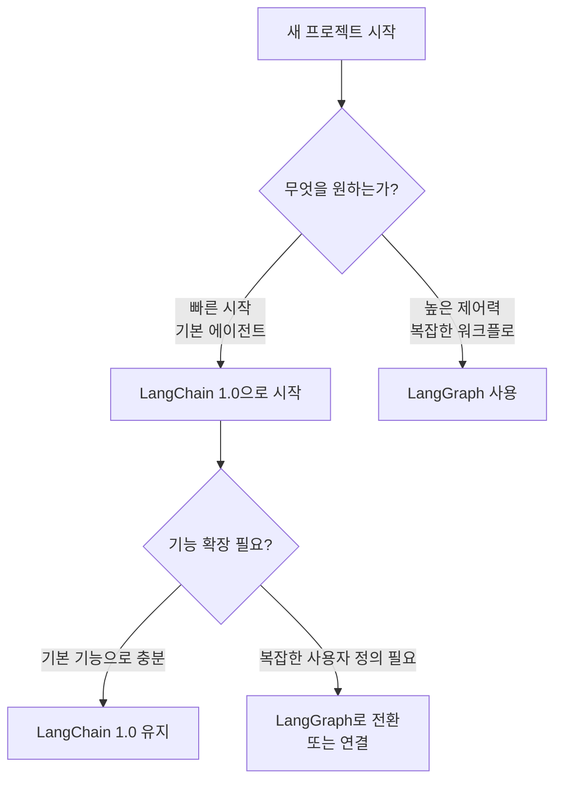

#  Building LangChain and LangGraph 1.0

## 개요

LangChain과 LangGraph 1.0 정식 릴리즈를 소개하는 공식 유튜브 영상의 요약입니다. LangChain의 공동 창립자이자 CEO인 해리슨과 오픈 소스 엔지니어들이 3년간의 발전 과정과 1.0 버전의 핵심 내용을 설명합니다.

- **영상**: [Building LangChain and LangGraph 1.0](https://www.youtube.com/watch?v=r5Z_gYZb4Ns)
- **출처**: LangChain 공식 유튜브 채널
- **주요 발표자**: 해리슨 체이스(CEO), 시드니, 헌터, 윌(엔지니어)

## LangChain의 초기 비전과 발전

### 시작 (약 3년 전, ChatGPT 출시 한 달 전)

LangChain은 두 가지 핵심 요소로 시작되었습니다:

1. **통합 세트 (Integrations)**
   - OpenAI, Cohere, Hugging Face 등의 모델 통합
   - 벡터 저장소, 문서 로더 등 핵심 구성 요소 통합

2. **상위 수준 인터페이스 (High-level Interface)**
   - 단 5줄의 코드로 RAG나 SQL 구현 가능
   - 초보자도 쉽게 AI 애플리케이션 구축 가능

### 패러다임 전환

산업이 성숙하고 사용자들이 프로토타입에서 실제 제품으로 전환하면서 LangChain의 초점이 변화했습니다:
- 쉬운 시작 → **프로덕션 준비**
- 단순한 추상화 → **제어 가능성과 사용자 정의**

## LangGraph의 탄생과 핵심 원칙

LangGraph는 LangChain 출시 약 1년 반 후에 개발되었으며, 두 가지 핵심 원칙을 바탕으로 합니다:

### 1. 제어 가능성 (Control)

- **문제**: LangChain은 시작하기 쉬웠지만 프로덕션 환경에서 사용자 정의가 어려움
  - '5줄 코드 RAG'는 내부적으로 많은 가정과 숨겨진 컨텍스트 엔지니어링 수행
  - 수정 시 낮은 수준의 제어 기능 필요

- **해결**: 일반 소프트웨어를 작성하는 것처럼 쉽게 사용자 정의 가능하도록 설계
  - 모델 기능과 프로덕션 안정성 간의 격차 해소
  - 예상치 못한 사용자 상호작용에 대한 적절한 프롬프트와 안전 장치 구성 가능
  - 장기 실행 에이전트의 범위 제어

### 2. 런타임 (Runtime)

- **내구성 있는 실행 환경**
  - 오류 발생 시 체크포인트에서 복구 가능
  - 전체 실행을 취소할 필요 없음

- **기본 기능으로서의 스트리밍**
  - 사용자가 에이전트의 진행 상황 실시간 확인 가능
  - 프레임워크 내에서 스트리밍 네이티브 지원

- **휴먼-인-더-루프 (Human-in-the-loop)**
  - LangChain 초기에는 고려되지 않았던 중요한 요소
  - LangGraph에서 핵심 기능으로 설계

## LangChain 1.0: LangGraph 기반의 쉬운 시작

### 핵심 특징

**LangChain 1.0 = LangGraph의 강력함 + LangChain의 쉬운 시작**

1. **LangGraph 런타임 기반**
   - 휴먼-인-더-루프
   - 지속성 (Persistence)
   - 내구성 있는 실행

2. **에이전트 생성 추상화**
   - 노드, 에지, 워크플로 기본 요소에 익숙하지 않아도 됨
   - 몇 줄의 코드로 모델 도구 호출 루프 시작 가능
   - LangGraph의 `create_react_agent` 패턴 계승 및 개선

### 목표

> **생성형 AI, 특히 에이전트 구축을 시작하는 가장 쉬운 곳**

## 미들웨어: 에이전트 루프의 확장성

### 개념

미들웨어는 개발자가 **핵심 에이전트 루프의 어느 시점에든 추가 로직을 추가**할 수 있게 하는 LangChain 1.0의 핵심 기능입니다.

### 주요 미들웨어 유형

1. **요약 미들웨어**
   - 모델 호출 전 과거 대화 기록 요약

2. **휴먼-인-더-루프 미들웨어**
   - 위험하거나 비용이 많이 드는 도구 호출 전 사람의 승인

3. **동적 프롬프트/도구 미들웨어**
   - 상황에 따른 프롬프트 및 도구 사용자 정의

4. **동적 모델 미들웨어** ⭐
   - 컨텍스트 기반으로 메시지 재생성
   - 작업에 따라 최적의 모델 동적 선택
   - 예: 코딩(Anthropic), 추론(OpenAI), 멀티모달(Google)

### 의미

- 더 이상 하나의 챔피언 모델이 존재하지 않음
- 모델 간 선택 가능성은 LangChain의 원래 목표
- 에이전트 구축의 최첨단 유지

## 모델 통합의 발전: 콘텐츠 블록

### 진화 과정

1. **초기**: 문자열 입력 → 문자열 출력
2. **발전**: 메시지 목록 입력 → 메시지 출력
3. **현재**: 멀티모달 모델로 인한 복잡성 증가

### 콘텐츠 블록의 필요성

**문제**:
- 모든 제공업체가 콘텐츠 블록 형태에 대해 고유한 의견 보유
- 심지어 서버 측 도구도 제공업체마다 다름
- 모델 변경 시 메시지 형태가 바뀌어 스트리밍 코드 등이 망가짐

**해결**:
- 콘텐츠 블록 표준화
- 개발자들이 메시지 형태에 대한 불확실성 없이 애플리케이션 구축 가능

## LangChain과 LangGraph: 언제 무엇을 사용할 것인가?

### 권장 접근 방식

### LangChain 1.0 사용 시나리오

✅ **다음과 같은 경우에 적합**:
- 에이전트를 빠르게 시작하고 싶을 때
- 높은 수준의 구성 요소 사용
- 다양한 추상화에 대해 깊이 생각하지 않고 유용한 작업 수행
- AI와 파이썬 프로그래밍 처음 시작
- 프로덕션 준비된 런타임이 필요할 때

**특징**:
- 최저점(진입 장벽)은 낮아지고 상한선(기능)은 높아짐
- 프로덕션 준비된 런타임 제공

### LangGraph 사용 시나리오

✅ **다음과 같은 경우에 적합**:
- 매우 사용자 정의된 워크플로
- 에이전트가 더 복잡하게 "사고"하기를 원할 때
- 결정론적 단계와 에이전트 단계를 명시적으로 구분
- 컨텍스트 엔지니어링을 강제하고 싶을 때
- 더 복잡한 에이전트 빌딩 주제에 익숙해지고 싶을 때

**특징**:
- 모든 것이 매우 구성 가능
- 결정론과 명시적인 단계, 워크플로 제어

### 하이브리드 접근

LangChain의 에이전트 생성을 사용하여 기능적인 에이전트를 구축한 다음 **기존 LangGraph 워크플로에 연결** 가능

## 미래 전망: 커뮤니티의 역할과 UI/UX

### 커뮤니티의 역할

**가장 기대되는 점**: 커뮤니티에서 어떤 맞춤형 미들웨어를 개발할지

현재 제공되는 미리 만들어진 미들웨어:
- 요약
- 동적 모델
- 도구
- 프롬프트
- 휴먼-인-더-루프

미들웨어의 특성:
- 매우 확장 가능
- 매우 구성 가능
- 커뮤니티의 창의적인 아이디어 기대

### UI/UX 개선

**투자 영역**:

1. **스트리밍 개선**
   - LangGraph의 핵심 구성 요소
   - LangChain의 기능 강화

2. **JavaScript 측면 강화**
   - JavaScript에서 모든 풀 스택 에이전트 생성
   - 프론트 엔드, 백 엔드, 상호 작용 패턴 탐색

### 지속적 발전

1.0 릴리스는 시작점이며, 사용자 피드백을 통해 계속 발전할 예정

## 참고 링크

- **공식 영상**: [Building LangChain and LangGraph 1.0](https://www.youtube.com/watch?v=r5Z_gYZb4Ns)
- **요약 출처**: [LiveWiki - LangChain & LangGraph 1.0 Building](https://livewiki.com/ko/content/langchain-langgraph-1-0-building)
- **LangGraph 공식 문서**: <https://langchain-ai.github.io/langgraph/>
- **LangChain 공식 문서**: <https://python.langchain.com/>

---

*최종 업데이트: 2025년 10월*
