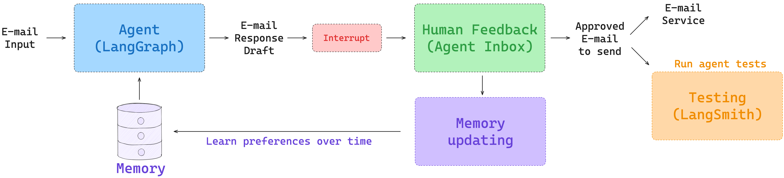
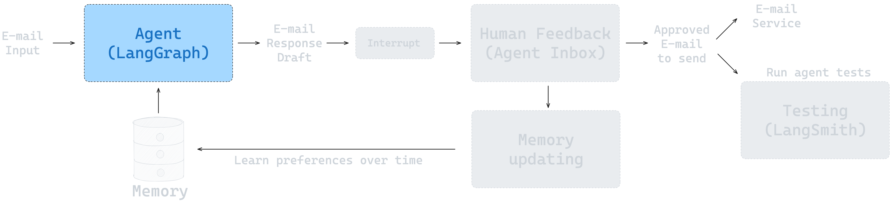
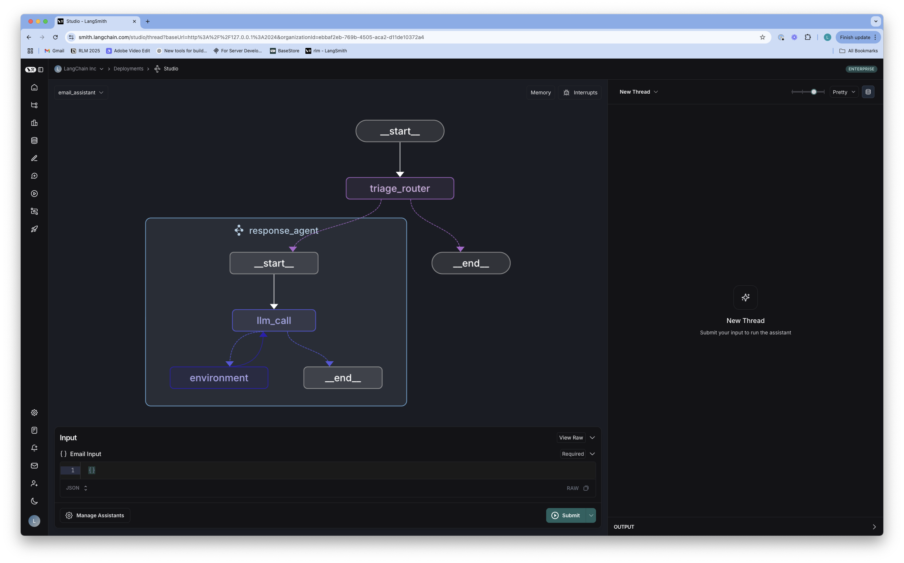
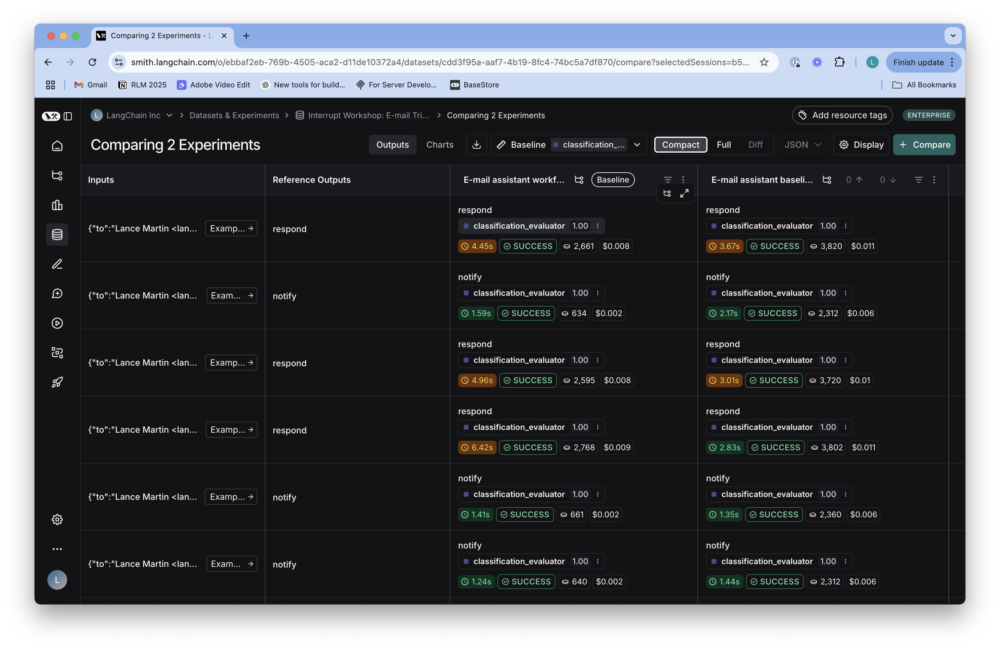
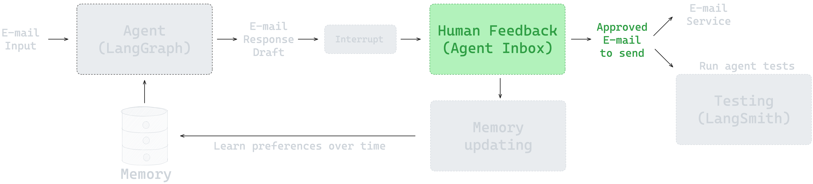
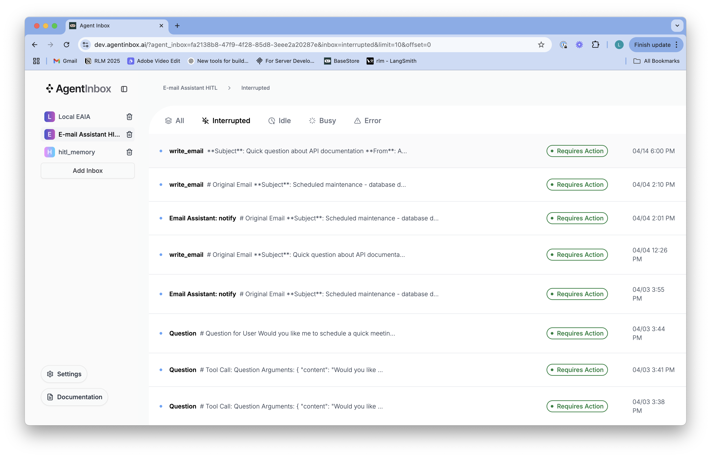
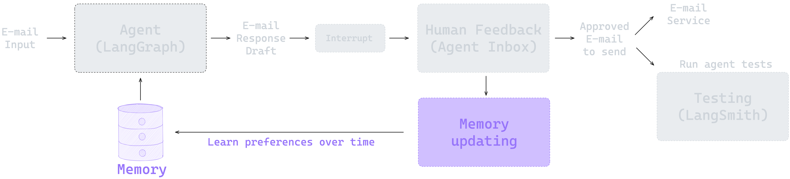

# Project: Ambient Agents with LangGraph

## 소개

Ambient Agents 프로젝트 시리즈에 오신 것을 환영합니다!

이 저장소는 에이전트를 처음부터 구축하는 방법을 안내합니다. Gmail API와 연결하여 이메일을 관리할 수 있는 ["앰비언트(ambient)"](https://blog.langchain.dev/introducing-ambient-agents/) 에이전트를 구축하는 것을 목표로 합니다.

LangChain의 목표는 에이전트 애플리케이션 구축을 최대한 용이하게 하는 것이며, **모델의 발전과 함께 에이전트의 상호 작용 방식도 변화하고 있습니다.** 과거에는 대부분 채팅 인터페이스를 통해 한 번에 하나의 상호 작용을 처리했지만, AI의 자율 수행 능력은 7개월마다 두 배로 증가하고 있습니다.

이러한 확장된 모델 기능은 새로운 종류의 에이전트 상호 작용을 가능하게 합니다. 이제 에이전트는 Slack 메시지나 GitHub 이슈와 같은 **이벤트 스트림에 의해 자율적으로 트리거될 수 있으며**, 백그라운드에서 장기간 여러 작업을 수행할 수 있게 되었습니다. 즉각적인 사용자 응답이 필요한 채팅 에이전트와 달리, 앰비언트 에이전트는 장기 실행되는 복잡한 작업을 위해 설계되었습니다.



## Ambient Agents란?

**Ambient Agents**는 사용자의 환경과 맥락을 이해하고, 지속적으로 상태를 추적하며, 필요한 시점에 적절한 행동을 취하는 지능형 에이전트를 의미합니다.

### 핵심 특징

- **맥락 인식**: 사용자의 현재 상황과 과거 이력을 이해합니다
- **상태 유지**: 대화 및 작업 상태를 지속적으로 관리합니다
- **능동적 행동**: 필요시 스스로 판단하여 행동합니다
- **적응성**: 환경 변화에 따라 동적으로 대응합니다

### 확장성과 영향력

앰비언트 에이전트를 사용하면 **영향력을 크게 확장하여 수천 개의 에이전트를 백그라운드에서 실행하며 복잡한 워크플로우를 자동화하고 오케스트레이션할 수 있습니다.** 중요한 것은 '앰비언트'가 완전 자율을 의미하지 않는다는 점입니다. 루프에 사람이 개입하는 것이 중요합니다. 이는 작업을 승인하거나 거부하고, 도구 호출을 편집하고, 질문에 답변하며, 에이전트의 상태를 수정하는 등의 형태로 이루어집니다.

이러한 **인간-에이전트 상호 작용은 결과의 품질과 신뢰도를 높이고, 시간이 지남에 따라 에이전트의 메모리 및 성능을 향상시키는 데 기여합니다.**

### LangGraph 플랫폼의 역할

LangGraph는 이러한 요구 사항을 염두에 두고 설계된 에이전트 오케스트레이션 프레임워크입니다:

- **지속성 레이어**: 사용자가 에이전트 상태를 쉽게 보고, 다시 방문하고, 수정할 수 있도록 하는 'Human-in-the-loop' 상호 작용 패턴을 지원합니다
- **확장 가능한 인프라**: 장기 실행 또는 버스트 워크로드에 이상적인 에이전트를 대규모로 실행할 수 있는 인프라를 제공합니다
- **모니터링 및 개선**: LangSmith는 관찰 가능성, 평가 및 프롬프트 엔지니어링을 위한 플랫폼을 제공하여 장기 실행 에이전트를 모니터링하고 개선하는 데 효과적입니다

## 학습 목표

### 과정 개요

이 과정에서는 **이메일 관리를 위한 자체 앰비언트 에이전트를 구축하는 단계를 안내합니다.** 이메일 관리는 거의 보편적이지만 많은 사람들이 자동화하고 싶어하는 작업입니다. 학습자들은 LangGraph의 기본 사항을 익히고 이를 사용하여 이메일 에이전트를 구축하게 됩니다.

저장소는 4개의 섹션으로 구성되어 있으며, 각 섹션마다 노트북과 `src/email_assistant` 디렉토리의 구현 코드가 함께 제공됩니다. 이 섹션들은 에이전트의 기본 사항부터 에이전트 평가, Human-in-the-loop, 그리고 메모리까지 단계적으로 구축됩니다. 이 모든 것이 배포 가능한 에이전트로 통합되며, 그 원칙은 다양한 작업에 걸쳐 다른 에이전트에도 적용할 수 있습니다.

### 핵심 학습 내용

이 프로젝트 시리즈를 통해 다음을 달성할 수 있습니다:

1. **기본 에이전트 구축**
   - LangGraph를 사용한 이메일 관리 에이전트 구현
   - 복잡한 상태를 관리하는 에이전트 설계 및 구현
   - 실시간 맥락을 추적하고 활용하는 시스템 구축

2. **평가 및 모니터링**
   - LangSmith를 사용하여 에이전트를 평가하는 방법 학습
   - 장기 실행 에이전트의 성능 모니터링 및 개선

3. **Human-in-the-loop 통합**
   - 이메일 보내기와 같은 민감한 작업을 승인하기 위한 'Human-in-the-loop' 기능 추가
   - 사용자 경험을 개선하는 워크플로우 구현

4. **메모리 및 적응성**
   - 에이전트가 시간이 지남에 따라 피드백을 기억하고 적응할 수 있도록 메모리 통합
   - 지속적인 학습을 통한 성능 향상

5. **배포 및 프로덕션**
   - LangGraph 플랫폼을 사용하여 에이전트 배포
   - 프로덕션 수준의 에이전트 시스템 운영

### 과정 완료 후

이 과정을 마치면:
- 작동하는 이메일 에이전트를 갖게 되며
- 광범위한 실제 작업에 대한 앰비언트 에이전트를 구축하고 배포할 수 있는 역량을 갖추게 됩니다

## 선수 지식

이 프로젝트 시리즈를 시작하기 전에 다음 내용을 이해하고 있는 것을 권장합니다:

### 필수
- Python 프로그래밍 기본
- LLM API 사용 경험 (OpenAI 등)
- [Foundation Module 1-2](../../langgraph-foundation/module-1/README.md): LangGraph 기초 및 상태 관리

### 권장
- [Foundation Module 3-4](../../langgraph-foundation/module-3/README.md): Human-in-the-loop 및 고급 패턴
- [Foundation Module 5-6](../../langgraph-foundation/module-5/README.md): 메모리 관리 및 배포

## 프로젝트 구성

이 저장소는 4개의 섹션으로 구성되어 있으며, 각 섹션마다 노트북과 `src/email_assistant` 디렉토리의 구현 코드가 함께 제공됩니다.

### 사전 학습: LangGraph 101

LangGraph와 이 저장소에서 사용되는 개념에 대한 간략한 소개는 [LangGraph 101 노트북](notebooks/langgraph_101.ipynb)을 참조하세요. 이 노트북은 채팅 모델, 도구 호출, 에이전트 vs 워크플로우, LangGraph 노드/엣지/메모리, LangGraph Studio의 기본 사항을 설명합니다.

### Project 1: 에이전트 구축

* **노트북**: [notebooks/agent.ipynb](/notebooks/agent.ipynb)
* **코드**: [src/email_assistant/email_assistant.py](/src/email_assistant/email_assistant.py)



이 노트북은 이메일 트리아지 단계와 이메일 응답을 처리하는 에이전트를 결합하여 이메일 어시스턴트를 구축하는 방법을 보여줍니다. `src/email_assistant/email_assistant.py`에서 전체 구현을 확인할 수 있습니다.

**주요 내용:**
- [이메일 트리아지 워크플로우](https://langchain-ai.github.io/langgraph/tutorials/workflows/) 구현
- 에이전트를 사용한 이메일 응답 자동화
- LangGraph를 활용한 복잡한 상태 관리



### Project 2: 평가 (Evaluation)

* **노트북**: [notebooks/evaluation.ipynb](/notebooks/evaluation.ipynb)


이 노트북은 [eval/email_dataset.py](/eval/email_dataset.py)의 이메일 데이터셋을 사용한 평가를 소개합니다. Pytest와 LangSmith `evaluate` API를 사용하여 평가를 실행하는 방법을 보여줍니다. LLM-as-a-judge를 사용한 이메일 응답 평가와 도구 호출 및 트리아지 결정에 대한 평가를 실행합니다.

**주요 내용:**
- LangSmith를 활용한 에이전트 평가
- LLM-as-a-judge 패턴 구현
- 도구 호출 및 의사 결정 품질 측정
- Pytest를 통한 자동화된 테스트



### Project 3: Human-in-the-loop

* **노트북**: [notebooks/hitl.ipynb](/notebooks/hitl.ipynb)
* **코드**: [src/email_assistant/email_assistant_hitl.py](/src/email_assistant/email_assistant_hitl.py)



이 노트북은 Human-in-the-loop(HITL)을 추가하여 사용자가 특정 도구 호출(예: 이메일 보내기, 회의 예약)을 검토할 수 있도록 하는 방법을 보여줍니다. 이를 위해 [Agent Inbox](https://github.com/langchain-ai/agent-inbox)를 Human-in-the-loop 인터페이스로 사용합니다. `src/email_assistant/email_assistant_hitl.py`에서 전체 구현을 확인할 수 있습니다.

**주요 내용:**
- 민감한 작업에 대한 사용자 승인 워크플로우
- Agent Inbox를 활용한 인터페이스 구현
- 에이전트 실행 중단 및 재개 메커니즘
- 사용자 피드백 통합



### Project 4: 메모리 (Memory)

* **노트북**: [notebooks/memory.ipynb](/notebooks/memory.ipynb)
* **코드**: [src/email_assistant/email_assistant_hitl_memory.py](/src/email_assistant/email_assistant_hitl_memory.py)



이 노트북은 이메일 어시스턴트에 메모리를 추가하여 시간이 지남에 따라 사용자 피드백을 학습하고 선호도에 적응할 수 있도록 하는 방법을 보여줍니다. 메모리 기능이 활성화된 어시스턴트([email_assistant_hitl_memory.py](/src/email_assistant/email_assistant_hitl_memory.py))는 [LangGraph Store](https://langchain-ai.github.io/langgraph/concepts/memory/#long-term-memory)를 사용하여 메모리를 지속합니다. `src/email_assistant/email_assistant_hitl_memory.py`에서 전체 구현을 확인할 수 있습니다.

**주요 내용:**
- LangGraph Store를 활용한 장기 메모리 구현
- 사용자 선호도 학습 및 적응
- 메모리 기반 개인화
- 시간에 따른 성능 개선

## 환경 설정

### Python 버전

Python 3.11 이상을 사용해야 합니다. 이 버전은 LangGraph와 최적의 호환성을 위해 필요합니다.

```bash
python3 --version
```

### API 키

필요한 API 키를 준비하세요:

* OpenAI API 키가 없다면 [여기](https://openai.com/index/openai-api/)에서 가입하세요.
* LangSmith [여기](https://smith.langchain.com/)에서 가입하세요.
* LangSmith API 키를 생성하세요.

### 환경 변수 설정

루트 디렉토리에 `.env` 파일을 생성합니다:

```bash
# .env.example 파일을 .env로 복사
cp .env.example .env
```

`.env` 파일을 다음과 같이 편집합니다:

```bash
LANGSMITH_API_KEY=your_langsmith_api_key
LANGSMITH_TRACING=true
LANGSMITH_PROJECT="interrupt-workshop"
OPENAI_API_KEY=your_openai_api_key
```

또는 터미널에서 환경 변수를 설정할 수 있습니다:

```bash
export LANGSMITH_API_KEY=your_langsmith_api_key
export LANGSMITH_TRACING=true
export OPENAI_API_KEY=your_openai_api_key
```

### 패키지 설치

**권장: uv 사용 (더 빠르고 안정적)**

```bash
# uv가 설치되어 있지 않다면 먼저 설치
pip install uv

# 개발 의존성과 함께 패키지 설치
uv sync --extra dev

# 가상 환경 활성화
source .venv/bin/activate
```

**대안: pip 사용**

```bash
python3 -m venv .venv
source .venv/bin/activate
# 최신 버전의 pip 확보 (pyproject.toml을 사용한 편집 가능 설치에 필요)
python3 -m pip install --upgrade pip
# 편집 가능 모드로 패키지 설치
pip install -e .
```

> **⚠️ 중요**: 패키지 설치 단계를 건너뛰지 마세요! 이 편집 가능 설치는 노트북이 올바르게 작동하는 데 **필수적**입니다. 패키지는 `interrupt_workshop`으로 설치되며 import 이름은 `email_assistant`이므로, 어디서나 `from email_assistant import ...`로 가져올 수 있습니다.

## Gmail 통합 및 배포

위의 노트북들은 모의(mock) 이메일 및 캘린더 도구를 사용합니다.

### Gmail 통합

[Gmail Tools README](src/email_assistant/tools/gmail/README.md)의 지침에 따라 Google API 자격 증명을 설정하세요.

README에서는 또한 LangGraph 플랫폼에 그래프를 배포하는 방법도 설명합니다.

Gmail 통합의 전체 구현은 [src/email_assistant/email_assistant_hitl_memory_gmail.py](/src/email_assistant/email_assistant_hitl_memory_gmail.py)에 있습니다.

## LangGraph Studio 사용하기

각 프로젝트는 LangGraph Studio와 통합되어 있어, 그래프를 시각적으로 탐색하고 테스트할 수 있습니다.

### Studio 시작하기

```bash
cd projects/ambient-agents/studio/
langgraph dev
```

브라우저에서 다음 URL로 접속:
- 🎨 Studio UI: https://smith.langchain.com/studio/?baseUrl=http://127.0.0.1:2024
- 🚀 API: http://127.0.0.1:2024
- 📚 API Docs: http://127.0.0.1:2024/docs

## 테스트 실행

이 저장소에는 이메일 어시스턴트를 평가하기 위한 자동화된 테스트 스위트가 포함되어 있습니다.

테스트는 LangSmith를 사용한 추적과 함께 올바른 도구 사용 및 응답 품질을 검증합니다.

### run_all_tests.py로 테스트 실행

```bash
python tests/run_all_tests.py
```

### 테스트 결과

테스트 결과는 `.env` 파일에 지정된 프로젝트 이름(`LANGSMITH_PROJECT`)으로 LangSmith에 기록됩니다. 이를 통해 다음을 제공합니다:

- 에이전트 트레이스의 시각적 검사
- 상세한 평가 메트릭
- 다양한 에이전트 구현 비교

### 사용 가능한 테스트 구현

테스트에 사용할 수 있는 구현:
- `email_assistant` - 기본 이메일 어시스턴트

### 노트북 테스트

모든 노트북이 오류 없이 실행되는지 확인하는 테스트를 실행할 수도 있습니다:

```bash
# 모든 노트북 테스트 실행
python tests/test_notebooks.py

# 또는 pytest를 통해 실행
pytest tests/test_notebooks.py -v
```

## 학습 경로

1. **사전 학습**: LangGraph 101 노트북으로 기본 개념 이해
2. **Project 1**: 기본 이메일 에이전트 구축
3. **Project 2**: 평가 및 품질 측정
4. **Project 3**: Human-in-the-loop 통합
5. **Project 4**: 메모리 및 적응성 추가
6. **배포**: Gmail 통합 및 프로덕션 배포

## 향후 확장

[LangMem](https://langchain-ai.github.io/langmem/)을 추가하여 메모리를 관리할 수 있습니다:

* 백그라운드 메모리 컬렉션 관리
* 백그라운드 메모리에서 사실을 조회할 수 있는 메모리 도구 추가

## 다음 단계

프로젝트를 완료한 후에는:

- **[Tutorial](../../langgraph-tutorial/README.md)**: 다양한 고급 패턴 및 예제 탐구
- 자신만의 Ambient Agent 프로젝트 구축
- LangGraph 커뮤니티에 기여

## 리소스

### 공식 강의
- [LangChain Academy - Ambient Agents 강의실](https://academy.langchain.com/courses/take/ambient-agents/lessons/66147171-course-overview)

### 문서 및 플랫폼
- [LangGraph 공식 문서](https://langchain-ai.github.io/langgraph/)
- [LangChain 공식 문서](https://python.langchain.com/)
- [LangSmith](https://smith.langchain.com/)
- [GitHub 저장소](https://github.com/langchain-ai)

### 관련 문서
- [Agent Inbox](https://github.com/langchain-ai/agent-inbox) - Human-in-the-loop 인터페이스
- [LangMem](https://langchain-ai.github.io/langmem/) - 메모리 관리
